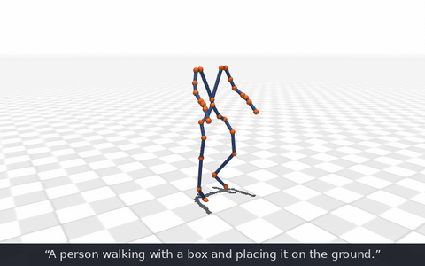
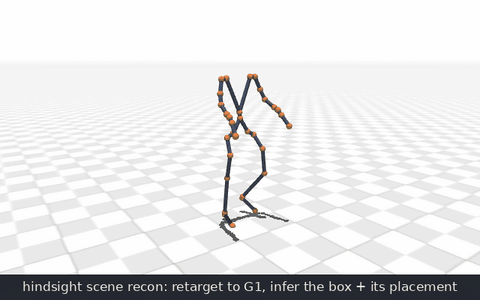
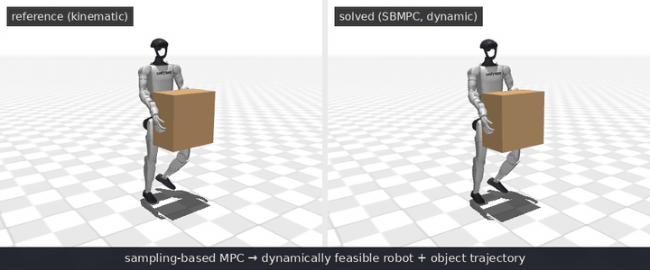

# motion_studio

Generate a single G1 motion clip with [Kimodo](https://github.com/nv-tlabs/kimodo), reconstruct the scene it implies, and solve for a **dynamically feasible robot+object trajectory**
([SPIDER](https://github.com/facebookresearch/spider) + mujoco_warp).

<!-- regenerate: MUJOCO_GL=egl .venv-solve/bin/python scripts/render_docs_gifs.py -->

**Generate** — Kimodo turns a text prompt into a motion clip (the checked-in
`samples/box_carrying.npz`):



**Reconstruct** — the clip is retargeted to the G1 and the scene it implies
(the box and its placement) is inferred in hindsight:



**Solve** — sampling-based MPC in mujoco_warp turns the kinematic reference
into a dynamically feasible robot+object trajectory:



## Setup (once)

Everything runs on your workstation **except the text encoder**: prompts are embedded by
LLM2Vec-8B, too heavy for a desktop GPU, so it runs as a cluster job and streams back over an SSH tunnel.

**On the cluster** — stage three things, once:

```bash
# 1. apptainer image, built from kimodo's Dockerfile (see extern/kimodo):
#    docker build -t kimodo extern/kimodo && apptainer build kimodo.sif docker-daemon://kimodo:latest
scp kimodo.sif euler:'$SCRATCH'/kimodo/kimodo.sif
# 2. a kimodo checkout:
ssh euler 'git clone https://github.com/nv-tlabs/kimodo.git $HOME/kimodo_ws/kimodo'
# 3. the encoder weights (the job runs offline):
ssh euler 'module load eth_proxy && export HF_HOME=$SCRATCH/kimodo/hf_cache && \
  huggingface-cli download McGill-NLP/LLM2Vec-Meta-Llama-3-8B-Instruct-mntp && \
  huggingface-cli download McGill-NLP/LLM2Vec-Meta-Llama-3-8B-Instruct-mntp-supervised'
```

Non-default locations: export `KIMODO_SIF` / `KIMODO_WORKSPACE` /
`KIMODO_HF_CACHE`, submit with `sbatch --export=ALL`.

**Locally:**

```bash
git clone <this-repo> && cd kimodo_studio
uv sync              # studio's own venv (CPU-only recon + verdicts)
uv run studio setup  # submodules + G1 assets + both heavy venvs (~13 GB)
uv run pytest        # verify
```

No config file needed — the upstreams are pinned submodules under `extern/`
and `studio setup` fetches them itself. `config.yml`
(see `config.example.yml`) only overrides defaults, e.g. to use your own
kimodo fork.

## Workflow

**1. Text embeddings** — once per authoring session:

```bash
sbatch remote/encoder_euler.sh   # on the cluster; job log prints "encoder node: <node>"
uv run studio tunnel <node>      # keep open
```

No cluster today? `studio demo --offline` serves prompts banked in
`offline_cache/`. Bank new ones while a tunnel is up:
`.venv-kimodo/bin/python scripts/encode_via_api.py --file offline_cache/prompts.txt --split`

**2. Motion generation** — the Kimodo viser demo
([how to use it](https://research.nvidia.com/labs/sil/projects/kimodo/)),
wrapped with a scene-recon add-on:

```bash
uv run studio demo               # http://127.0.0.1:7860
uv run studio watch              # optional: auto recon+solve+verdict on every Save Example
```

Prompt → **Generate** → **click the sample you like**, then **Save Example**
(picked up by `studio watch`) or the add-on's **Reconstruct scene** (overlays
the inferred scene in the demo viewer).

**3. Tune and solve:**

```bash
uv run studio panel     # :8082 — pick a clip from raw_motion/ (previews on
                        # select), set the contact window against the ghost
                        # box, Reconstruct, tune SBMPC hyperparams, Solve,
                        # and watch reference vs solution side by side
```

Or scripted, no GUI — works on the checked-in sample clip with no demo and no
cluster:

```bash
cp samples/box_carrying.npz raw_motion/
uv run studio recon raw_motion/box_carrying.npz --name demo
uv run studio solve demo         # --num-samples 1024 if VRAM is tight
uv run studio list               # runs + LIFT / DR verdicts
```

`studio -h` lists the rest (`run`, `view`, `promote`, per-flag help on each).

## Downstream tasks

Every task is a human-object interaction reconstructed from a robot-only
clip and solved by the same solver; what differs between tasks is data.
A task is two files: its glue in `src/studio/tasks/<task>.py` (scene
params, dropdown choices, solve-weight deltas, pass criterion — MuJoCo-free,
so both GUIs build their controls from it) and its reconstruction in
`src/studio/recon/<task>.py`, a `ReconTask` with two hooks that the shared
pipeline (`recon/run.py`) drives:

- **`detect(qpos, meta, params, options)`** — when, and with which hands,
  the robot touches the object;
- **`build(qpos, meta, interaction, params)`** — what the object is, where
  it goes, how the hands hold it, and the MuJoCo scene, composed from the
  shared kernels (`recon/mjcf.py` template surgery, `pick.calibrate_grasp`
  / `wrist_ik_frame`, `pole._conform_fingers`, `recon/objects.py` mesh
  roster).

The pipeline then does what every task needs: the frame-0 spawn check, the
per-palm contact reference, SceneBot's interaction-graph labels, and writes
the trial (`recon/spec.py`). The trial's `task_info.json` is the contract
the solver reads (`solve/spec.py`): `object.faces` (a box whose palm faces
are the contact targets), `object.symmetry`, `grips[]` (each holding hand's
palm pocket + object anchor), `supports[]`. The solver never sees a task
name. Every run records its task and `studio solve` / `studio list` follow
it; `box_carry` (everything above) is the default.

**`pole`** / **`chair`** — real-mesh object interaction. `pole` infers a
floor lamp / tripod / clothes stand from the hands of an object-free clip
(the hold reads as a hand pair stacked along the pole). `chair` takes a
BEHAVE clip (`raw_motion/behave/`, exported with the chair's own pose per
frame) and detects contact the way SceneBot defines it, against the actual
mesh: a hand holds the chair while its palm sits at the hull surface and
moves with the chair, and only if the chair moves meanwhile — an arm hanging
beside the backrest is not a grip; a pelvis parked over a chair that stays
put is a sit. Inside a hold, the *grip* is the stretch where the hand moves
rigidly with the chair (the BEHAVE hands slide 20-50 cm from first touch to
the carry). The chair is spawned from that contact: standing where the first
hand meets it (nudged out of the robot's approach), following the clip's
trajectory while held, pushed out of any body geom it passes through, parked
after the release — the chair scene restores the template's body collision
geoms (torso, pelvis, hips, shins, head, arms), so the solve can never pass
it through the body. Each grip gets an anchor on the member's centre line,
a grasp *fit* search (the closed hand slid along the member and turned
about it until it clears the neighbouring members), a 7-joint arm IK onto
that pose, and finger closure conformed onto the hulls. Carries are
multi-contact: each hand either *wraps* a member the closed hand can
enclose (legs, rails) or *presses* its open palm against a face it cannot
(seat underside, slats), and body geoms the chair rests on (torso, hip,
thighs, forearms) are detected as *supports*. The anchors feed the solve's
grip reward; `grasp_rew_scale` rewards hand geoms touching the object,
`grasp_pen_rew_scale` prices their penetration depth (no carrying a rail
buried in the palm box), and `support_rew_scale` keeps the body supports
the reference carries on.

```bash
uv run studio recon raw_motion/behave/chairwood/D01S01_chairwood_lift_c1_kin.npz \
    --task chair --name chair0        # --set left=off for a one-hand carry
uv run studio solve chair0            # LIFT / DR verdicts as for box_carry
```

Task knobs (scene params, solve-weight deltas) live in
`src/studio/tasks/<task>.py` (`SCENE_DEFAULTS`, `SOLVE_OVERRIDES`); override
per machine via config.yml's `tasks:` section or per run via
`--set key=value`. The solve subprocess is handed the fully resolved params
(`Task.solve_params`) and reads no config of its own.

## References

- **Kimodo** — Rempe et al., *Kimodo: Scaling Controllable Human Motion
  Generation* — [arXiv:2603.15546](https://arxiv.org/abs/2603.15546) ·
  [project page](https://research.nvidia.com/labs/sil/projects/kimodo/).
  The motion generator this studio authors with.
- **SPIDER** — Pan et al., *SPIDER: Scalable Physics-Informed Dexterous
  Retargeting* — [arXiv:2511.09484](https://arxiv.org/abs/2511.09484) ·
  [code](https://github.com/facebookresearch/spider). Supplies the sampling
  optimizer and batched mujoco_warp simulator; `solve/loop.py` derives from
  its `run_mjwp.py`.
- **SceneBot** — *SceneBot: Contact-Prompted General Humanoid Whole Body
  Tracking with Scene-Interaction* —
  [arXiv:2606.27581](https://arxiv.org/abs/2606.27581) ·
  [project page](https://ericcsr.github.io/scenebot/). `recon/` implements
  its hindsight scene reconstruction (Alg. 1).
- **DynaRetarget** — Dhedin et al., *DynaRetarget: Dynamically-Feasible
  Retargeting using Sampling-Based Trajectory Optimization* —
  [arXiv:2602.06827](https://arxiv.org/abs/2602.06827). The LIFT / DR
  verdicts implement its feasibility criteria.
